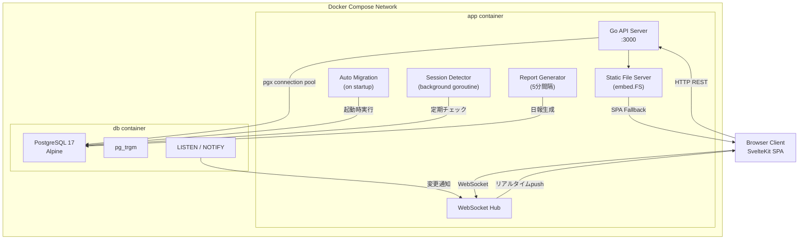
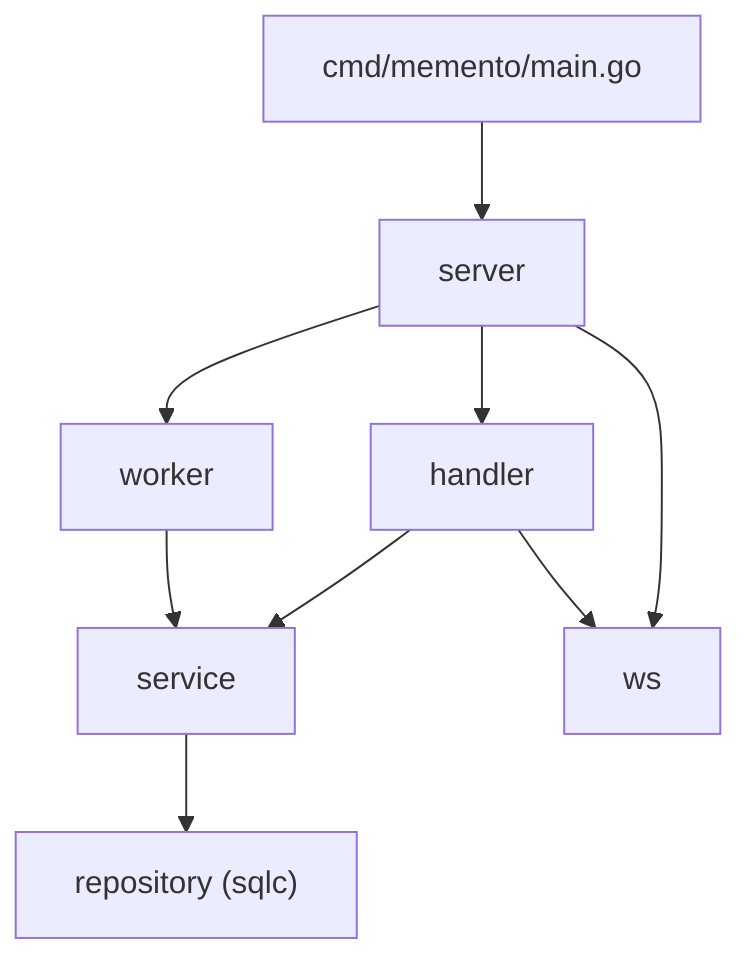
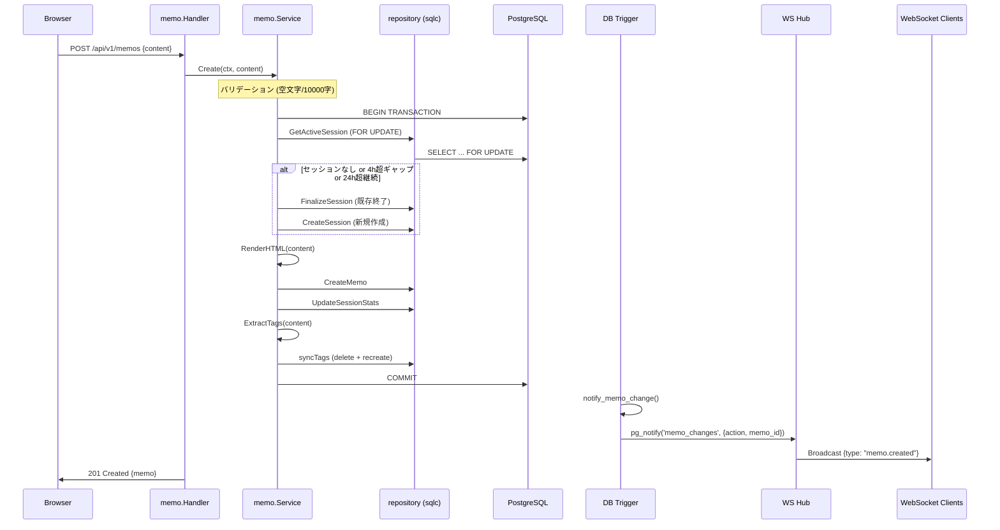
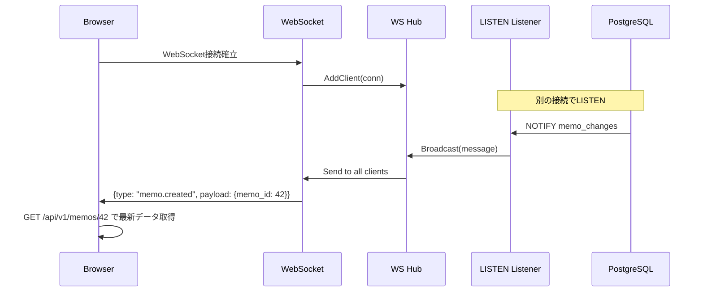
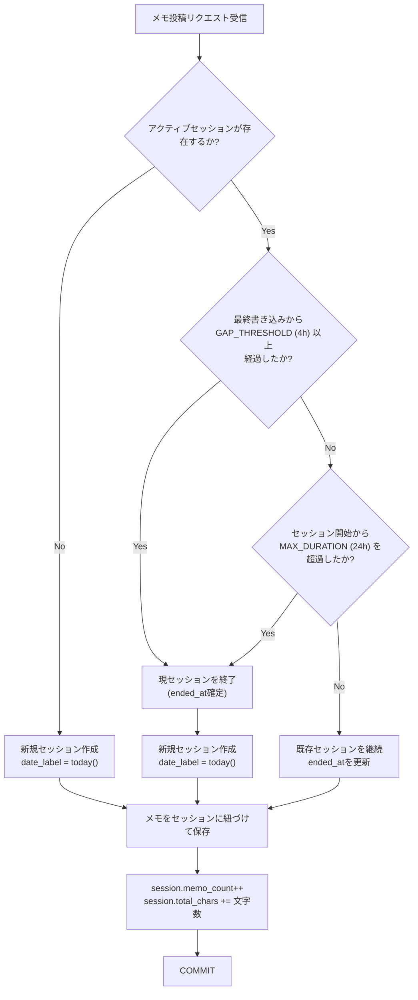
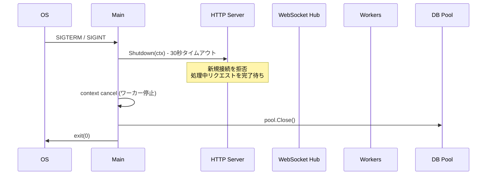

# Architecture

Memento Memo のシステムアーキテクチャと設計思想を解説する。

---

## 1. システム全体像



### 設計原則

| 原則 | 内容 |
|------|------|
| **ゼロコンフィグ** | ユーザーに設定を強いない。すべてが合理的なデフォルトで動作する |
| **省リソース** | NAS級の貧弱な計算環境でも快適に動作する（合計100-150MB） |
| **完全自己完結** | `docker compose up -d` で起動、`docker compose down -v` で痕跡なく消える |
| **標準技術優先** | 車輪の再発明はしないが、不要な外部依存も持ち込まない |
| **エンタープライズ品質** | テスト、CI/CD、監視、マイグレーションを含む本番運用水準の設計 |

---

## 2. プロセス構成

本番環境で稼働するプロセスは**厳密に2つ**のみ。

| コンテナ | プロセス | 想定メモリ |
|----------|---------|-----------|
| `app` | Goバイナリ（API + 静的配信 + WebSocket + ワーカー） | 20-50MB |
| `db` | PostgreSQL 17 Alpine | 50-100MB |

Goバイナリ内で以下の機能が協調動作する:

```
main()
├── HTTP Server (net/http)
│   ├── REST API handlers
│   ├── WebSocket upgrade handler
│   └── SPA static file server (embed.FS)
├── WebSocket Hub (goroutine)
│   └── LISTEN/NOTIFY listener (goroutine)
├── Session Detector Worker (goroutine)
└── Report Generator Worker (goroutine)
```

---

## 3. レイヤードアーキテクチャ



### 各レイヤーの責務

| レイヤー | 責務 | 依存先 |
|----------|------|--------|
| **cmd/memento** | エントリーポイント。起動シーケンスの制御 | server, config |
| **server** | HTTPサーバー初期化、ルーティング、ミドルウェア適用 | handler, ws, worker |
| **handler** | HTTPリクエストのパース、レスポンス構築、エラーハンドリング | service |
| **service** | ビジネスロジック（セッション検出、タグ抽出、日報生成） | repository |
| **repository** | データアクセス（sqlc自動生成コード） | PostgreSQL |
| **ws** | WebSocket接続管理、メッセージブロードキャスト | PostgreSQL (LISTEN) |
| **worker** | バックグラウンドジョブ（日報生成、GC） | service |

依存は常に上から下への**一方向**。`repository` は `service` 以外から直接呼ばない。`handler` は SQL を直接書かない。

> **なぜクリーンアーキテクチャの厳密なレイヤー分割をしないか:** お一人様アプリで過剰なインターフェース抽象化はコードの見通しを悪化させるだけ。実用的なフラットパッケージ構成で十分な関心の分離を実現している。

---

## 4. データフロー

### 4.1 メモ作成フロー



### 4.2 リアルタイム更新フロー



### 4.3 WebSocket再接続フロー

```
切断検出
  ↓
初回再接続 (0ms) → 失敗 → 1s → 2s → 4s → 8s → ... → 最大30s
  ↓ 成功
backoff リセット
  ↓
GET /api/v1/memos?since={最後のタイムスタンプ}
  ↓
差分メモをタイムラインに追加
```

ブラウザタブが非アクティブな場合は再接続を一時停止し、`visibilitychange` イベントで復帰時に再開する。

---

## 5. セッション自動検出アルゴリズム



### 閾値の設計根拠

| 条件 | 値 | 根拠 |
|------|-----|------|
| GAP_THRESHOLD | 4時間 | 最短の仮眠（4時間程度）で区切り。食事・入浴・短い外出は継続として扱う |
| MAX_DURATION | 24時間 | 連日徹夜でセッションが際限なく伸びることを防止。「1暦日」の粒度を保つ安全弁 |

これらは内部定数であり、**ユーザーには一切公開しない**。

### トランザクション制御

`GetActiveSession` は `SELECT ... FOR UPDATE` で行ロックを取得し、複数タブからの同時投稿による二重セッション作成を防止する。セッション判定からメモ作成、タグ同期まですべてを単一トランザクション内で実行する。

---

## 6. ミドルウェアチェーン

```go
handler := middleware.Chain(
    middleware.Recovery,            // panicからの回復
    middleware.RequestID,           // リクエストID付与
    middleware.Logger,              // slogアクセスログ
    middleware.SecurityHeaders,     // X-Content-Type-Options, CSP, etc.
    middleware.MaxBodySize(1<<20),  // リクエストボディ上限 1MB
    middleware.RateLimit,           // Token Bucket (100 req/s)
)(mux)
```

| ミドルウェア | 目的 |
|-------------|------|
| **Recovery** | panicをキャッチしスタックトレースをログ出力。500応答を返す |
| **RequestID** | 全リクエストにUUID付与。構造化ログでのトレースに使用 |
| **Logger** | method, path, status, latency を slog JSON で出力 |
| **SecurityHeaders** | XSS, Clickjacking, Content-Type sniffing 対策 |
| **MaxBodySize** | Slowloris / 巨大ペイロード攻撃対策 |
| **RateLimit** | Token Bucket方式。バグや暴走スクリプトへの安全弁 |

> **CORSミドルウェアを配置しない理由:** GoサーバーがSPAとAPIを同一オリジンで配信するため、ブラウザからのリクエストはすべて同一オリジンとなりCORSは発動しない。

---

## 7. フロントエンドアーキテクチャ

### 状態管理

Svelte 5 Runes（`$state`, `$derived`, `$effect`）によるクラスベースの状態管理。外部状態管理ライブラリは不使用。

```typescript
// memos.svelte.ts - Svelte 5 Runes によるリアクティブ状態管理
class MemoStore {
    items = $state<Memo[]>([]);
    cursor = $state<string | null>(null);
    loading = $state(false);
    hasMore = $state(true);

    async loadMore() { /* カーソルページネーション */ }
    async create(content: string) { /* Optimistic UI で即反映 */ }
    prependMemo(memo: Memo) { /* WebSocket経由の新規メモ追加 */ }
}
```

### コンポーネント構成

```
+layout.svelte          ← Sidebar + WebSocket接続管理
├── +page.svelte        ← MemoComposer + MemoTimeline
├── search/             ← SearchBar + 検索結果
├── calendar/           ← GitHub草ヒートマップ
├── tags/               ← タグ一覧
├── tags/[name]/        ← タグ別メモ一覧
├── trash/              ← ゴミ箱（復元・永久削除）
└── stats/              ← 統計ダッシュボード
```

### 無限スクロール

`IntersectionObserver` でタイムライン末尾の sentinel 要素を監視し、表示領域に入ったら次ページを自動取得する。仮想スクロールはメモの高さが不定のため初期実装では導入しない。

---

## 8. セキュリティ設計

### 入力バリデーション

| 項目 | 制約 |
|------|------|
| メモ本文 | 最大10,000文字（`utf8.RuneCountInString` で正確にカウント） |
| タグ名 | 最大50文字。`[\p{L}\p{N}_]` のみ許可 |
| HTML出力 | `bluemonday` でサーバーサイドサニタイズ |
| SQL | `sqlc` の生成コードでパラメータバインディングを保証 |

### セキュリティヘッダー

```
X-Content-Type-Options: nosniff
X-Frame-Options: DENY
X-XSS-Protection: 0
Referrer-Policy: strict-origin-when-cross-origin
Content-Security-Policy: default-src 'self'; script-src 'self'; style-src 'self' 'unsafe-inline'; img-src 'self' data: https:;
```

### 認証

初期リリースでは認証機構を設けない（お一人様アプリであり、ローカルネットワーク内アクセスを前提）。将来的にシンプルなパスワード認証を追加する設計余地を確保。

---

## 9. Graceful Shutdown



---

## 10. Docker ビルド

### マルチステージビルド

```
Stage 1: node:22-alpine     → SvelteKit ビルド (npm ci + npm run build)
Stage 2: golang:1.23-alpine → Go バイナリビルド (COPY --from=frontend web/dist)
Stage 3: alpine:3.20        → 実行イメージ (~20MB)
```

最終イメージには Go バイナリ + CA証明書 + tzdata のみが含まれる。非rootユーザー `memento` で実行。

### embed.FS によるフロントエンド内包

```go
//go:build !dev

//go:embed dist/*
var assets embed.FS
```

ビルドタグ `dev` で開発時と本番時の挙動を切り替える:
- **本番 (`!dev`):** `web/dist/` の静的ファイルをGoバイナリに内包
- **開発 (`dev`):** embed なし。Vite dev server にプロキシ
