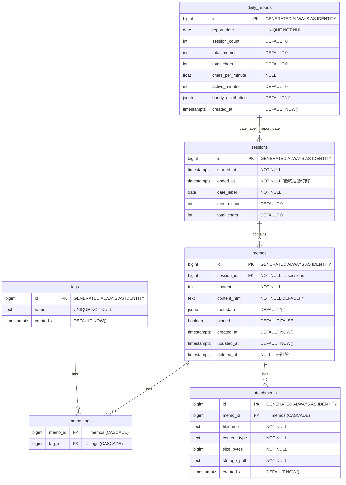

# Database Design

Memento Memo のデータベース設計。PostgreSQL 17 の固有機能を積極活用する。

---

## 設計方針

- PostgreSQL固有機能の積極活用: `GENERATED ALWAYS AS IDENTITY`, `TIMESTAMPTZ`, `JSONB`, `pg_trgm`, `LISTEN/NOTIFY`
- 正規化を基本とするが、読み取りパフォーマンスのために JSONB による非正規化を許容
- 論理削除（`deleted_at`）を採用し、ゴミ箱機能を実現
- 文字数カウントは `utf8.RuneCountInString` で正確にカウント（`len()` はバイト数のため日本語で乖離）

---

## ER図



---

## テーブル詳細

### sessions

作業セッションを管理する。4時間のギャップ閾値と24時間の継続上限でセッション境界を自動検出する。

```sql
CREATE TABLE sessions (
    id          BIGINT GENERATED ALWAYS AS IDENTITY PRIMARY KEY,
    started_at  TIMESTAMPTZ NOT NULL,
    ended_at    TIMESTAMPTZ NOT NULL,
    date_label  DATE NOT NULL,
    memo_count  INT NOT NULL DEFAULT 0,
    total_chars INT NOT NULL DEFAULT 0
);

CREATE INDEX idx_sessions_date_label ON sessions (date_label);
CREATE INDEX idx_sessions_started_at ON sessions (started_at DESC);
```

| カラム | 説明 |
|--------|------|
| `started_at` | セッション開始時刻（最初のメモ投稿時刻） |
| `ended_at` | 最終活動時刻。メモ投稿ごとに `NOW()` で更新。セッション終了時に確定値として記録 |
| `date_label` | カレンダー表示・日報用の日付ラベル。`started_at` の日付部分 |
| `memo_count` | 累計メモ数。**論理削除時に減算しない**（活動記録としての性質を維持） |
| `total_chars` | 累計文字数。同上 |

> **非正規化カウンタの設計方針:** `memo_count` と `total_chars` は「その時間帯にどれだけ書いたか」を表す活動指標であり、現在の残存メモ数ではない。ヒートマップ（草）は執筆活動の可視化が目的であり、削除後に草が消えるのは直感に反する。

---

### memos

メモの本体。Markdown本文とサーバーサイドで変換済みのHTMLを両方保持する。

```sql
CREATE TABLE memos (
    id           BIGINT GENERATED ALWAYS AS IDENTITY PRIMARY KEY,
    session_id   BIGINT NOT NULL REFERENCES sessions(id) ON DELETE CASCADE,
    content      TEXT NOT NULL,
    content_html TEXT NOT NULL DEFAULT '',
    metadata     JSONB NOT NULL DEFAULT '{}',
    pinned       BOOLEAN NOT NULL DEFAULT FALSE,
    created_at   TIMESTAMPTZ NOT NULL DEFAULT NOW(),
    updated_at   TIMESTAMPTZ NOT NULL DEFAULT NOW(),
    deleted_at   TIMESTAMPTZ
);

CREATE INDEX idx_memos_session_id ON memos (session_id);
CREATE INDEX idx_memos_created_at ON memos (created_at DESC) WHERE deleted_at IS NULL;
CREATE INDEX idx_memos_pinned ON memos (pinned) WHERE pinned = TRUE AND deleted_at IS NULL;
CREATE INDEX idx_memos_content_trgm ON memos USING GIN (content gin_trgm_ops);
```

| カラム | 説明 |
|--------|------|
| `content` | Markdown 原文 |
| `content_html` | goldmark + bluemonday で変換・サニタイズ済み HTML |
| `metadata` | 将来の拡張用 JSONB（OGP情報、デバイス情報など） |
| `deleted_at` | NULL=未削除。ソフトデリート後30日で物理削除 |

**インデックス設計:**

| インデックス | 種類 | 条件 | 目的 |
|-------------|------|------|------|
| `idx_memos_created_at` | B-Tree | `deleted_at IS NULL` | タイムライン表示の高速化。部分インデックスで削除済みを除外 |
| `idx_memos_pinned` | B-Tree | `pinned = TRUE AND deleted_at IS NULL` | ピン留めメモの高速取得 |
| `idx_memos_content_trgm` | GIN (pg_trgm) | - | 全文検索の高速化。`ILIKE` クエリを加速 |

---

### tags / memo_tags

メモ本文中の `#タグ` を自動抽出して管理する。

```sql
CREATE TABLE tags (
    id         BIGINT GENERATED ALWAYS AS IDENTITY PRIMARY KEY,
    name       TEXT NOT NULL UNIQUE,
    created_at TIMESTAMPTZ NOT NULL DEFAULT NOW()
);

CREATE TABLE memo_tags (
    memo_id BIGINT NOT NULL REFERENCES memos(id) ON DELETE CASCADE,
    tag_id  BIGINT NOT NULL REFERENCES tags(id) ON DELETE CASCADE,
    PRIMARY KEY (memo_id, tag_id)
);

CREATE INDEX idx_memo_tags_tag_id ON memo_tags (tag_id);
```

**タグ同期の方式:** メモ更新時は delete-and-recreate（既存タグ関連を全削除 → 再抽出で再挿入）。メモあたりのタグ数は高々数十件であり、差分計算より全置換の方がコードの単純さとバグの少なさで優る。

**タグ抽出の正規表現:**

```
(?:^|\s)#([\p{L}\p{N}_]+)
```

- `\p{L}`: Unicode文字（日本語対応）
- `\p{N}`: Unicode数字
- `_`: アンダースコア
- 直前が文頭または空白であることを要求し、`[text](#anchor)` や `https://example.com#section` の誤検出を防止

---

### attachments (Phase 2)

添付ファイルのメタデータ。実体はDockerボリューム内のローカルファイルシステムに保存。

```sql
CREATE TABLE attachments (
    id           BIGINT GENERATED ALWAYS AS IDENTITY PRIMARY KEY,
    memo_id      BIGINT NOT NULL REFERENCES memos(id) ON DELETE CASCADE,
    filename     TEXT NOT NULL,
    content_type TEXT NOT NULL,
    size_bytes   BIGINT NOT NULL,
    storage_path TEXT NOT NULL,
    created_at   TIMESTAMPTZ NOT NULL DEFAULT NOW()
);
```

---

### daily_reports

バックグラウンドワーカーが5分間隔で自動生成する日報。

```sql
CREATE TABLE daily_reports (
    id                   BIGINT GENERATED ALWAYS AS IDENTITY PRIMARY KEY,
    report_date          DATE NOT NULL UNIQUE,
    session_count        INT NOT NULL DEFAULT 0,
    total_memos          INT NOT NULL DEFAULT 0,
    total_chars          INT NOT NULL DEFAULT 0,
    chars_per_minute     FLOAT,
    active_minutes       INT NOT NULL DEFAULT 0,
    hourly_distribution  JSONB NOT NULL DEFAULT '{}',
    created_at           TIMESTAMPTZ NOT NULL DEFAULT NOW()
);
```

| カラム | 説明 |
|--------|------|
| `chars_per_minute` | 字速（総文字数 / アクティブ分）。アクティブ時間0の場合は NULL |
| `hourly_distribution` | 時間帯別メモ数。`{"0": 3, "1": 5, "9": 2, ...}` |

> `sessions.date_label` と `daily_reports.report_date` は同一の日付値で直接結合できる（`JOIN sessions ON date_label = report_date`）。中間テーブルは不要。

---

## トリガー

### updated_at 自動更新

```sql
CREATE OR REPLACE FUNCTION update_updated_at()
RETURNS TRIGGER AS $$
BEGIN
    NEW.updated_at = NOW();
    RETURN NEW;
END;
$$ LANGUAGE plpgsql;

CREATE TRIGGER trg_memos_updated_at
    BEFORE UPDATE ON memos
    FOR EACH ROW
    EXECUTE FUNCTION update_updated_at();
```

### リアルタイム通知

```sql
CREATE OR REPLACE FUNCTION notify_memo_change()
RETURNS TRIGGER AS $$
BEGIN
    PERFORM pg_notify('memo_changes', json_build_object(
        'action', TG_OP,
        'memo_id', COALESCE(NEW.id, OLD.id),
        'session_id', COALESCE(NEW.session_id, OLD.session_id)
    )::text);
    RETURN COALESCE(NEW, OLD);
END;
$$ LANGUAGE plpgsql;

CREATE TRIGGER trg_memo_notify
    AFTER INSERT OR UPDATE OR DELETE ON memos
    FOR EACH ROW
    EXECUTE FUNCTION notify_memo_change();
```

Go側の WebSocket Hub が `LISTEN memo_changes` で通知を受信し、接続中の全クライアントにブロードキャストする。ペイロードは `memo_id` と `session_id` のみ（数十バイト）で、PostgreSQL の NOTIFY ペイロード上限（8,000バイト）に対して十分余裕がある。

---

## マイグレーション

`goose` を使用し、SQL マイグレーションファイルを Go バイナリに `embed.FS` で同梱する。アプリケーション起動時に自動実行。

```
db/migrations/
  0001_create_sessions.sql    -- セッションテーブル + インデックス
  0002_create_memos.sql       -- メモテーブル + 部分インデックス
  0003_create_tags.sql        -- タグ + 中間テーブル
  0004_create_attachments.sql -- 添付ファイル (Phase 2)
  0005_create_daily_reports.sql -- 日報テーブル
  0006_add_triggers.sql       -- pg_trgm拡張, GINインデックス, トリガー
```

各ファイルには `-- +goose Up` と `-- +goose Down` の両方向を定義。ダウンマイグレーションは手動実行のみ。

---

## クエリ一覧

sqlc により SQL から型安全な Go コードを自動生成する。

### セッション関連

| クエリ名 | 種類 | 説明 |
|---------|------|------|
| `GetActiveSession` | :one | 最新セッションを `FOR UPDATE` ロック付きで取得 |
| `CreateSession` | :one | 新規セッション作成 |
| `FinalizeSession` | :exec | セッション終了（ended_at 確定） |
| `UpdateSessionStats` | :exec | memo_count++, total_chars += N, ended_at 更新 |
| `ListSessions` | :many | 日付範囲でセッション一覧取得 |
| `GetHeatmapData` | :many | 日別の memo_count, total_chars 集計 |
| `GetDailySummary` | :many | 特定日のセッション一覧 |

### メモ関連

| クエリ名 | 種類 | 説明 |
|---------|------|------|
| `CreateMemo` | :one | メモ作成 |
| `GetMemo` | :one | ID指定でメモ取得 |
| `ListMemosFirst` | :many | 最初のページ取得 |
| `ListMemos` | :many | カーソル付きページ取得 |
| `ListMemosSince` | :many | since パラメータ付き取得 |
| `UpdateMemo` | :one | メモ更新（deleted_at IS NULL 条件付き） |
| `SoftDeleteMemo` | :exec | 論理削除 |
| `RestoreMemo` | :exec | 復元 |
| `PermanentDeleteMemo` | :exec | 物理削除 |
| `TogglePin` | :one | ピン切り替え |
| `ListDeletedMemos` | :many | ゴミ箱一覧 |
| `PurgeOldDeletedMemos` | :exec | 30日超の論理削除メモを物理削除 |

### 検索関連

| クエリ名 | 種類 | 説明 |
|---------|------|------|
| `SearchMemosFirst` | :many | ILIKE 検索（最初のページ） |
| `SearchMemos` | :many | ILIKE 検索（カーソル付き） |

### タグ関連

| クエリ名 | 種類 | 説明 |
|---------|------|------|
| `UpsertTag` | :one | タグの INSERT or UPDATE |
| `DeleteMemoTags` | :exec | メモに紐づくタグ関連を全削除 |
| `CreateMemoTag` | :exec | メモ-タグ関連を作成 |
| `ListTags` | :many | タグ一覧（使用数降順） |
| `ListMemosByTagFirst` | :many | タグ別メモ一覧（最初のページ） |
| `ListMemosByTag` | :many | タグ別メモ一覧（カーソル付き） |
| `GetMemoTags` | :many | メモに紐づくタグ一覧 |

### 日報関連

| クエリ名 | 種類 | 説明 |
|---------|------|------|
| `GetDailyReport` | :one | 日報取得 |
| `UpsertDailyReport` | :one | 日報の作成または更新（冪等） |
| `GetStats` | :one | 全体統計（サブクエリ集計） |
| `GetFinalizedSessions` | :many | 終了済みセッションの日付一覧 |
| `GetMemosBySession` | :many | セッション内のメモ一覧 |
| `GetMemosByDateLabel` | :many | 日付別メモ一覧 |

---

## パフォーマンス最適化

| 対策 | 詳細 |
|------|------|
| **部分インデックス** | `deleted_at IS NULL` でソフトデリートされたレコードをインデックスから除外 |
| **GINインデックス** | `pg_trgm` による全文検索。10万件まで <50ms |
| **コネクションプール** | pgxpool で接続を再利用（max 10, min 2） |
| **LISTEN専用接続** | プールとは別に確立。プール接続数を圧迫しない |
| **shared_buffers** | 128MB に設定（PostgreSQL デフォルト 32MB から引き上げ） |
| **effective_cache_size** | 256MB（クエリプランナーに利用可能キャッシュ量を通知） |
